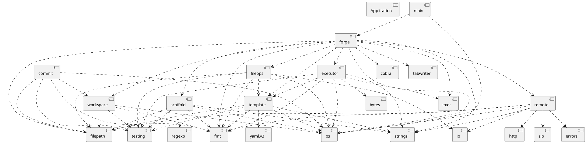
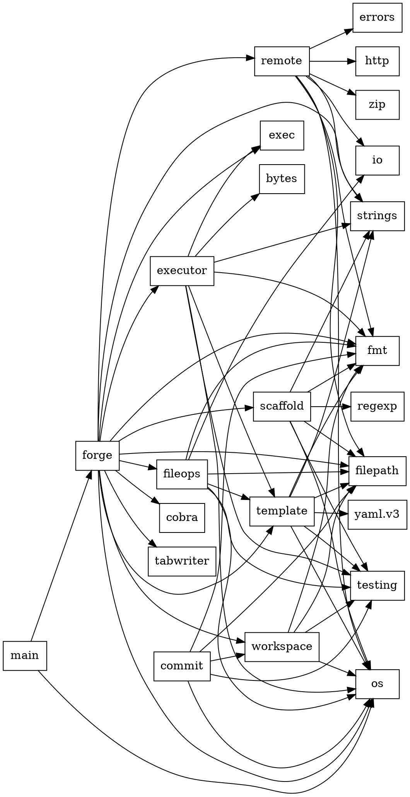

# Codebase Analysis

## Table of Contents
- [cmd/forge/init.go](#cmd-forge-init-go)
- [cmd/forge/install.go](#cmd-forge-install-go)
- [cmd/forge/list.go](#cmd-forge-list-go)
- [cmd/forge/new.go](#cmd-forge-new-go)
- [cmd/forge/pull.go](#cmd-forge-pull-go)
- [cmd/forge/root.go](#cmd-forge-root-go)
- [cmd/forge/test.go](#cmd-forge-test-go)
- [cmd/forge/uninstall.go](#cmd-forge-uninstall-go)
- [internal/commit/commit.go](#internal-commit-commit-go)
- [internal/commit/commit_test.go](#internal-commit-commit-test-go)
- [internal/executor/executor.go](#internal-executor-executor-go)
- [internal/executor/executor_test.go](#internal-executor-executor-test-go)
- [internal/fileops/fileops.go](#internal-fileops-fileops-go)
- [internal/fileops/fileops_test.go](#internal-fileops-fileops-test-go)
- [internal/remote/download.go](#internal-remote-download-go)
- [internal/scaffold/new.go](#internal-scaffold-new-go)
- [internal/scaffold/new_test.go](#internal-scaffold-new-test-go)
- [internal/template/template.go](#internal-template-template-go)
- [internal/template/template_test.go](#internal-template-template-test-go)
- [internal/workspace/workspace.go](#internal-workspace-workspace-go)
- [internal/workspace/workspace_test.go](#internal-workspace-workspace-test-go)
- [main.go](#main-go)
- [Dependency Graph](#dependency-graph)

## cmd/forge/init.go

**Package:** `forge`

**Description:** No file-level documentation found.

### Functions

- **`init`**: No documentation found.
- **`runInit`**: No documentation found.
- **`validateTargetDirectory`**: No documentation found.

### Imports

- `fmt`
- `os`
- `path/filepath`
- `forge/internal/executor`
- `forge/internal/fileops`
- `forge/internal/template`
- `github.com/spf13/cobra`

---

## cmd/forge/install.go

**Package:** `forge`

**Description:** No file-level documentation found.

### Functions

- **`init`**: No documentation found.
- **`runInstall`**: No documentation found.
- **`copyFile`**: No documentation found.
- **`setupGlobalTemplates`**: No documentation found.
- **`setForgeTemplatesEnvVar`**: No documentation found.
- **`addToPath`**: No documentation found.

### Imports

- `fmt`
- `os`
- `os/exec`
- `path/filepath`
- `strings`
- `github.com/spf13/cobra`

---

## cmd/forge/list.go

**Package:** `forge`

**Description:** No file-level documentation found.

### Functions

- **`init`**: No documentation found.
- **`runList`**: No documentation found.
- **`discoverTemplates`**: No documentation found.
- **`findTemplatesDir`**: No documentation found.

### Imports

- `fmt`
- `os`
- `path/filepath`
- `text/tabwriter`
- `forge/internal/template`
- `github.com/spf13/cobra`

---

## cmd/forge/new.go

**Package:** `forge`

**Description:** No file-level documentation found.

### Functions

- **`init`**: No documentation found.
- **`runNew`**: No documentation found.
- **`determineTemplatesDirForNew`**: No documentation found.

### Imports

- `fmt`
- `os`
- `path/filepath`
- `forge/internal/scaffold`
- `github.com/spf13/cobra`

---

## cmd/forge/pull.go

**Package:** `forge`

**Description:** No file-level documentation found.

### Functions

- **`init`**: No documentation found.
- **`runPull`**: No documentation found.
- **`getGlobalTemplatesDir`**: No documentation found.
- **`pullSingleTemplate`**: No documentation found.
- **`pullAllTemplates`**: No documentation found.

### Imports

- `fmt`
- `os`
- `path/filepath`
- `github.com/spf13/cobra`
- `forge/internal/remote`

---

## cmd/forge/root.go

**Package:** `forge`

**Description:** No file-level documentation found.

### Functions

- **`Execute`**: No documentation found.
- **`init`**: No documentation found.
- **`exitWithError`**: No documentation found.

### Imports

- `fmt`
- `os`
- `github.com/spf13/cobra`

---

## cmd/forge/test.go

**Package:** `forge`

**Description:** No file-level documentation found.

### Functions

- **`init`**: No documentation found.
- **`runTest`**: No documentation found.

### Imports

- `fmt`
- `forge/internal/executor`
- `forge/internal/fileops`
- `forge/internal/template`
- `forge/internal/workspace`
- `github.com/spf13/cobra`

---

## cmd/forge/uninstall.go

**Package:** `forge`

**Description:** No file-level documentation found.

### Functions

- **`init`**: No documentation found.
- **`runUninstall`**: No documentation found.
- **`removeFromPath`**: No documentation found.
- **`removeForgeTemplatesEnv`**: No documentation found.
- **`createAndSpawnCleanupScript`**: No documentation found.

### Imports

- `fmt`
- `os`
- `os/exec`
- `path/filepath`
- `strings`
- `github.com/spf13/cobra`

---

## internal/commit/commit.go

**Package:** `commit`

**Description:** No file-level documentation found.

### Functions

- **`New`**: New creates a new committer
- **`Commit`**: Commit moves the workspace contents to the target directory
- **`copyDirContents`**: copyDirContents copies all contents from src to dst
- **`copyFile`**: copyFile copies a single file with permissions
- **`isSubPath`**: isSubPath checks if child path is inside parent path
- **`startsWithDotDot`**: startsWithDotDot checks if path starts with ".."

### Imports

- `fmt`
- `os`
- `path/filepath`
- `forge/internal/workspace`

---

## internal/commit/commit_test.go

**Package:** `commit`

**Description:** No file-level documentation found.

### Functions

- **`TestCommitBasic`**: No documentation found.
- **`TestCommitNonEmptyTargetFails`**: No documentation found.
- **`TestCommitPreservesFilePerms`**: No documentation found.

### Imports

- `os`
- `path/filepath`
- `testing`

---

## internal/executor/executor.go

**Package:** `executor`

**Description:** No file-level documentation found.

### Functions

- **`New`**: New creates a new command executor
- **`Run`**: Run executes a command in the workspace

### Imports

- `bytes`
- `fmt`
- `os`
- `os/exec`
- `strings`
- `forge/internal/template`

---

## internal/executor/executor_test.go

**Package:** `executor`

**Description:** No file-level documentation found.

### Functions

- **`TestExecutorRun`**: No documentation found.
- **`TestExecutorRunFailure`**: No documentation found.
- **`TestExecutorRunEmptyCommand`**: No documentation found.

### Imports

- `os`
- `testing`
- `forge/internal/template`

---

## internal/fileops/fileops.go

**Package:** `fileops`

**Description:** No file-level documentation found.

### Functions

- **`New`**: New creates a new file operations handler
- **`CopyFiles`**: CopyFiles copies files/directories from template to workspace
- **`ApplyAppends`**: ApplyAppends applies append-only patches
- **`copyFile`**: copyFile copies a single file
- **`copyDir`**: copyDir recursively copies a directory

### Imports

- `fmt`
- `io`
- `os`
- `path/filepath`
- `forge/internal/template`

---

## internal/fileops/fileops_test.go

**Package:** `fileops`

**Description:** No file-level documentation found.

### Functions

- **`TestCopyFile`**: No documentation found.
- **`TestCopyDir`**: No documentation found.
- **`TestApplyAppends`**: No documentation found.
- **`TestApplyAppendsNonExistentTarget`**: No documentation found.

### Imports

- `os`
- `path/filepath`
- `testing`
- `forge/internal/template`

---

## internal/remote/download.go

**Package:** `remote`

**Description:** No file-level documentation found.

### Functions

- **`DownloadRepoZip`**: DownloadRepoZip downloads the given URL into a temporary file and returns the path to the downloaded zip file. Caller must remove the file.
- **`detectZipPrefix`**: detectZipPrefix returns the top-level prefix present in paths inside the zip, e.g. "forge-templates-main/". If none found, empty string is returned.
- **`ListTopLevelTemplates`**: ListTopLevelTemplates lists the top-level directories (template names) contained in the zip archive. It does not extract files.
- **`extractPrefixedFiles`**: extractPrefixedFiles extracts all files under zipPrefix/templateName/ into destDir. It validates presence of template.yaml inside the extracted content.
- **`InstallSingleTemplate`**: InstallSingleTemplate extracts the requested template from the zip archive into destParentDir/templateName
- **`InstallAllTemplates`**: InstallAllTemplates extracts top-level directories that contain template.yaml into destParentDir. It returns a slice of installed template names and an error.

### Imports

- `archive/zip`
- `errors`
- `fmt`
- `io`
- `net/http`
- `os`
- `path/filepath`
- `strings`

---

## internal/scaffold/new.go

**Package:** `scaffold`

**Description:** No file-level documentation found.

### Functions

- **`New`**: New creates a new scaffold generator
- **`ValidateName`**: ValidateName checks if template name is valid
- **`Generate`**: Generate creates a new template scaffold
- **`generateTemplateYAML`**: No documentation found.
- **`generateReadme`**: No documentation found.
- **`GetNextSteps`**: GetNextSteps returns helpful instructions after creating a template

### Imports

- `fmt`
- `os`
- `path/filepath`
- `regexp`
- `strings`

---

## internal/scaffold/new_test.go

**Package:** `scaffold`

**Description:** No file-level documentation found.

### Functions

- **`TestValidateName`**: No documentation found.
- **`TestGenerate`**: No documentation found.
- **`TestGenerateDuplicate`**: No documentation found.
- **`TestGenerateInvalidName`**: No documentation found.
- **`contains`**: No documentation found.

### Imports

- `os`
- `path/filepath`
- `testing`

---

## internal/template/template.go

**Package:** `template`

**Description:** No file-level documentation found.

### Functions

- **`String`**: String returns a human-readable representation of the command
- **`Load`**: Load loads and validates a template from the given path It accepts both full paths and template names For template names, it searches in: 1. ./templates/<name> 2. $FORGE_TEMPLATES/<name> 3. $HOME/.forge/templates/<name>
- **`ResolveTemplatePath`**: ResolveTemplatePath resolves a template path by: 1. Trying the literal path 2. If not found, treating it as a name and searching standard locations
- **`getSearchPaths`**: getSearchPaths returns the list of paths to search for a template name
- **`loadFromPath`**: loadFromPath loads a template from a resolved path
- **`validate`**: validate checks if the template is valid
- **`HasFileOps`**: HasFileOps returns true if the template has any file operations

### Imports

- `fmt`
- `os`
- `path/filepath`
- `strings`
- `gopkg.in/yaml.v3`

---

## internal/template/template_test.go

**Package:** `template`

**Description:** No file-level documentation found.

### Functions

- **`TestTemplateLoad`**: No documentation found.
- **`TestCommandString`**: No documentation found.
- **`TestHasFileOps`**: No documentation found.

### Imports

- `os`
- `testing`

---

## internal/workspace/workspace.go

**Package:** `workspace`

**Description:** No file-level documentation found.

### Functions

- **`New`**: New creates a new temporary workspace
- **`Path`**: Path returns the absolute path to the workspace
- **`Cleanup`**: Cleanup removes the workspace directory and all its contents
- **`GetVolume`**: GetVolume returns the volume/drive letter of the given path (Windows-specific) Returns empty string on non-Windows or if volume cannot be determined
- **`SameVolume`**: SameVolume checks if two paths are on the same volume

### Imports

- `fmt`
- `os`
- `path/filepath`

---

## internal/workspace/workspace_test.go

**Package:** `workspace`

**Description:** No file-level documentation found.

### Functions

- **`TestWorkspaceNew`**: No documentation found.
- **`TestWorkspaceIsolation`**: No documentation found.
- **`TestSameVolume`**: No documentation found.
- **`TestGetVolume`**: No documentation found.

### Imports

- `os`
- `path/filepath`
- `testing`

---

## main.go

**Package:** `main`

**Description:** No file-level documentation found.

### Functions

- **`main`**: No documentation found.

### Imports

- `os`
- `forge/cmd/forge`

---

## Dependency Graph

### PlantUML

### Graphviz

