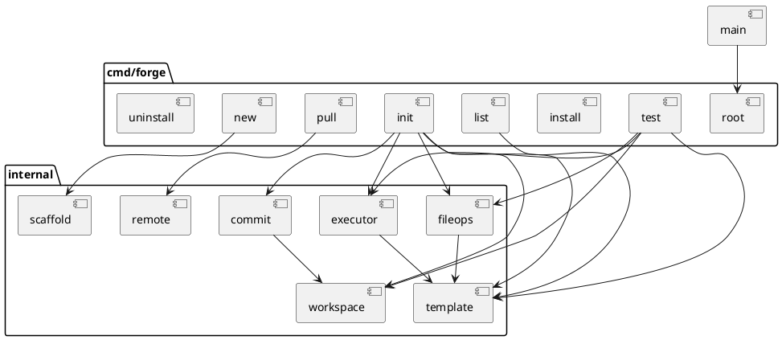
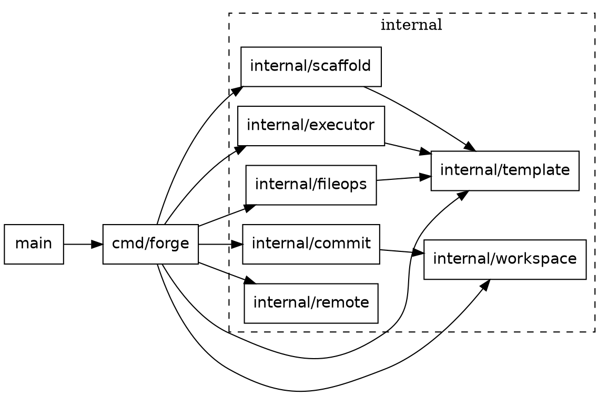

# Codebase Explanation and Analysis

This document provides a detailed explanation of the Forge codebase, describing the purpose of each file, the functions within them, and how the components interact.

## Table of Contents
- [Entry Point](#entry-point)
- [Command Layer (`cmd/forge`)](#command-layer-cmdforge)
- [Internal Packages (`internal/`)](#internal-packages-internal)
    - [commit](#internalcommit)
    - [executor](#internalexecutor)
    - [fileops](#internalfileops)
    - [remote](#internalremote)
    - [scaffold](#internalscaffold)
    - [template](#internaltemplate)
    - [workspace](#internalworkspace)
- [Dependency Graphs](#dependency-graphs)

---

## Entry Point

### `main.go`
**Purpose**: This is the entry point of the application. It hands off execution to the Cobra command framework defined in `cmd/forge`.

**Functions**:
- `main()`: Calls `forge.Execute()` and exits with status 1 if an error occurs.

---

## Command Layer (`cmd/forge`)

This package contains the CLI command definitions using the Cobra library.

### `cmd/forge/root.go`
**Purpose**: Defines the root command (`forge`) and global configuration. It sets up the base description and version information.

**Functions**:
- `Execute() error`: The main entry point for the CLI. It executes the root command.
- `init()`: Initializes the root command, disabling default completion commands.
- `exitWithError(msg string, err error)`: A helper function to print an error message to stderr and exit the program with status 1.

### `cmd/forge/init.go`
**Purpose**: Implements the `forge init` command. This is the core command that initializes a new project from a template.

**Functions**:
- `init()`: Registers the `init` command with the root command.
- `runInit(cmd *cobra.Command, args []string)`:
    - Resolves the template path or name.
    - Creates a temporary workspace (`internal/workspace`).
    - Loads the template configuration (`internal/template`).
    - Executes the template's commands in the workspace (`internal/executor`).
    - Applies file operations (copy/patch) (`internal/fileops`).
    - Commits the workspace to the final destination (`internal/commit`).
    - Cleans up the workspace on success or failure.

### `cmd/forge/install.go`
**Purpose**: Implements the `forge install` command, which installs the Forge binary to a location in the user's PATH (or system-wide).

**Functions**:
- `init()`: Registers the `install` command and its flags (`--system`).
- `runInstall(cmd *cobra.Command, args []string)`:
    - Determines the installation directory (User `bin` or `Program Files`).
    - Copies the running executable to the target location.
    - Updates the user's PATH environment variable using PowerShell if necessary.
    - Persists installation state to `%USERPROFILE%/.forge/config.yaml` (first install only)
    - Flags supported: `--force` (re-run full setup), `--bin-only` (replace only binary)

### `cmd/forge/list.go`
**Purpose**: Implements the `forge list` command to display available templates.

**Functions**:
- `init()`: Registers the `list` command.
- `runList(cmd *cobra.Command, args []string)`:
    - Locates the templates directory (local, env var, or global).
    - Scans for valid templates using `discoverTemplates`.
    - Prints a tabulated list of templates with their metadata.
- `discoverTemplates(baseDir string) ([]templateInfo, error)`: Walks the directory tree to find `template.yaml` files and parses them.
- `findTemplatesDir() string`: Heuristic to find the default templates directory.

### `cmd/forge/new.go`
**Purpose**: Implements the `forge new` command to scaffold a *new template*. This helps users create their own templates.

**Functions**:
- `init()`: Registers the `new` command.
- `runNew(cmd *cobra.Command, args []string)`:
    - Determines where to create the new template.
    - Uses `internal/scaffold` to generate the template structure (YAML, README, dirs).
    - Prints next steps for the user.
- `determineTemplatesDirForNew() string`: Decides the target directory for the new template based on environment variables and existence of global folders.

### `cmd/forge/pull.go`
**Purpose**: Implements the `forge pull` command to download templates from a remote repository (e.g., GitHub).

**Functions**:
- `init()`: Registers the `pull` command and `--all` flag.
- `runPull(cmd *cobra.Command, args []string)`:
    - orchestrates the download process using `internal/remote`.
    - Can pull a single template or all templates.
- `getGlobalTemplatesDir() (string, error)`: Returns the path to the user's global template storage (`~/.forge/templates`).
- `pullSingleTemplate(templateName, globalDir string) error`: Downloads the repo zip and extracts a specific template.
- `pullAllTemplates(globalDir string) error`: Downloads the repo zip and extracts all valid templates.

### `cmd/forge/test.go`
**Purpose**: Implements the `forge test` command. This allows template authors to run a template in a temporary workspace *without* committing it, to verify it works.

**Functions**:
- `init()`: Registers the `test` command.
- `runTest(cmd *cobra.Command, args []string)`:
    - Loads the template.
    - Creates a temporary workspace.
    - Runs the template in "test mode" (non-interactive, using `test_cmd` overrides).
    - Applies file operations.
    - Prints the location of the temporary workspace for inspection (does not clean it up immediately so the user can check it).

### `cmd/forge/uninstall.go`
**Purpose**: Implements the `forge uninstall` command to remove the tool and its traces.

**Functions**:
- `init()`: Registers the `uninstall` command.
- `runUninstall(cmd *cobra.Command, args []string)`:
    - Removes the `forge` executable.
    - Removes the global templates directory.
    - Removes `%USERPROFILE%/.forge/config.yaml` during cleanup
    - Removes `forge` from the PATH variable.
    - Spawns a self-deleting PowerShell script (`createAndSpawnCleanupScript`) to delete the currently running executable after it exits.
- `removeFromPath(dir string) error`: Uses PowerShell to remove a directory from the user's PATH.
- `removeForgeTemplatesEnv()`: Removes the `FORGE_TEMPLATES` environment variable.
- `createAndSpawnCleanupScript(exePath string) error`: Generates and runs a background script to delete the binary.

---

## Internal Packages (`internal/`)

These packages contain the core logic of the application, separated by concern.

### `internal/commit`

#### `commit.go`
**Purpose**: Handles the "commit" phase of the transaction. It moves or copies the contents of the temporary workspace to the final user-specified destination.

**Functions**:
- `Commit(workspacePath, targetPath string) error`:
    - Checks if the target directory is empty (safety check).
    - Attempts to move the workspace directory to the target (atomic rename).
    - If moving fails (e.g., cross-volume), falls back to `copyDirContents`.
- `copyDirContents(src, dst string) error`: Recursively copies files from source to destination.
- `copyFile(src, dst string) error`: Copies a single file, preserving permissions.
- `isSubPath(parent, child string) (bool, error)`: Security check to ensure paths are safe.
- `startsWithDotDot(path string) bool`: Helper for path validation.

---

### `internal/executor`

#### `executor.go`
**Purpose**: Responsible for executing system commands defined in the template.

**Functions**:
- `New(workDir string, interactive bool, testMode bool) *Executor`: Creates a new Executor instance.
- `Run(cmd template.Command) error`:
    - Executes a command in the context of the workspace.
    - Handles "Test Mode": If running `forge test`, it skips interactive commands or uses `test_cmd`.
    - Handles I/O: In normal mode, connects stdin/out/err to the user's terminal. In test mode, captures output to buffers.

---

### `internal/fileops`

#### `fileops.go`
**Purpose**: Handles file manipulation tasks defined in the template: copying static files and appending content to existing files.

**Functions**:
- `New(workspaceDir, templatePath string) *FileOps`: Creates a new FileOps instance.
- `CopyFiles(copyPaths []string) error`: Copies files or directories from the template's `files/` directory to the workspace.
- `ApplyAppends(patches []template.AppendPatch) error`: Appends content from the template's `patches/` directory to target files in the workspace.
- `copyFile(src, dst string) error`: Utility to copy a file.
- `copyDir(src, dstBase string) error`: Utility to recursively copy a directory.

---

### `internal/remote`

#### `download.go`
**Purpose**: Handles downloading and extracting templates from a remote URL (e.g., a GitHub ZIP archive).

**Functions**:
- `DownloadRepoZip(url string) (string, error)`: Downloads a file from a URL to a temporary location.
- `detectZipPrefix(r *zip.Reader) string`: Identifies the top-level folder inside a ZIP (e.g., `repo-main/`) to handle GitHub's archive structure.
- `ListTopLevelTemplates(zipPath string) ([]string, error)`: Lists potential templates inside a ZIP without extracting.
- `extractPrefixedFiles(zipPath, zipPrefix, templateName, destDir string) error`: Extracts a specific subdirectory from the ZIP to a destination.
- `InstallSingleTemplate(zipPath, templateName, destParentDir string) error`: Orchestrates the installation of one template.
- `InstallAllTemplates(zipPath, destParentDir string) ([]string, error)`: Orchestrates the installation of all valid templates found in the ZIP.

---

### `internal/scaffold`

#### `new.go`
**Purpose**: Logic for generating *new* templates (used by `forge new`).

**Functions**:
- `New(templatesDir string) *Generator`: Creates a scaffold generator.
- `ValidateName(name string) error`: Ensures the template name is valid (alphanumeric, etc.).
- `Generate(name string) (string, error)`:
    - Creates the directory structure (`files/`, `patches/`).
    - Generates a default `template.yaml`.
    - Generates a `README.md`.
- `generateTemplateYAML(name string) string`: Returns the default YAML content.
- `generateReadme(name string) string`: Returns the default README content.
- `GetNextSteps(templateDir, templateName string) string`: Returns instructions for the user.

---

### `internal/template`

#### `template.go`
**Purpose**: Defines the data structures for a template and handles loading/parsing `template.yaml`.

**Functions**:
- `Load(templatePath string) (*Template, error)`: Resolves a path/name and loads the template.
- `ResolveTemplatePath(templatePath string) (string, error)`: Finds a template by checking local paths, `FORGE_TEMPLATES`, and the global directory.
- `getSearchPaths(templateName string) []string`: Helper to list locations to search.
- `loadFromPath(resolvedPath string) (*Template, error)`: Reads and unmarshals the YAML file.
- `validate()`: validation logic for the template structure (required fields, etc.).
- `HasFileOps() bool`: Returns true if the template requires file copying or patching.

**Types**:
- `Template`: The root configuration structure.
- `Command`: Represents a shell command.
- `FileOps`: grouping for file operations.
- `AppendPatch`: definition for appending content.

---

### `internal/workspace`

#### `workspace.go`
**Purpose**: Manages the temporary directory where the project is assembled before being committed.

**Functions**:
- `New() (*Workspace, error)`: Creates a new temporary directory with a unique name.
- `Path() string`: Returns the path to the workspace.
- `Cleanup() error`: Deletes the workspace and its contents.
- `GetVolume(path string) string`: Windows-specific helper to get the drive letter.
- `SameVolume(path1, path2 string) bool`: Checks if two paths are on the same drive (important for atomic moves).

---

## Dependency Graphs

### PlantUML Component Diagram

This diagram shows how the packages relate to each other.

### Graphviz Dependency Graph

This graph visualizes the import dependencies between the internal packages.

